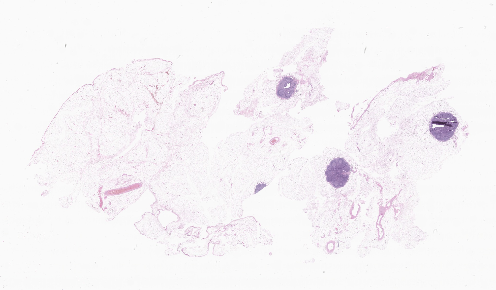
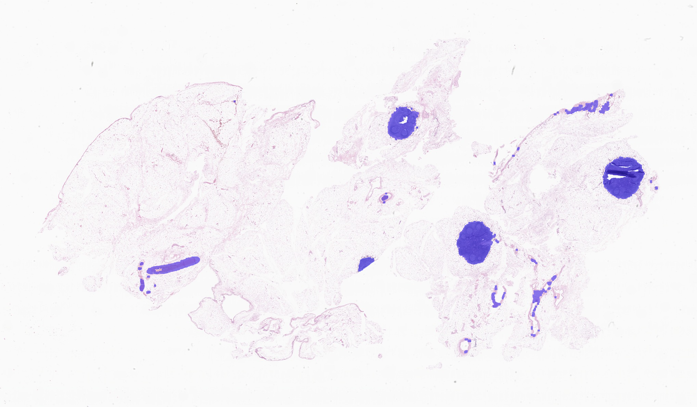

# ATLAS — Whole-Slide Image Preprocessing Pipeline

ATLAS is a research-oriented computational pathology pipeline for preprocessing histopathology whole-slide images (WSIs).

This repository implements tissue-aware preprocessing steps commonly used in computational pathology, including tissue masking, patch extraction, and visual quality control. The codebase is intended as a modular foundation for downstream representation learning and anomaly-based analysis.

## Pipeline Overview

The current pipeline includes:

1. Whole-slide image ingestion using OpenSlide
2. Low-resolution tissue masking
3. Tissue-aware patch extraction at full resolution
4. Visual validation via slide thumbnails and patch grids

All steps are designed to be simple, inspectable, and reproducible.

## Repository Structure

## Project Status

## ATLAS currently implements a complete whole-slide image (WSI) preprocessing
and tissue-aware patch extraction pipeline with visual quality control.

Baseline supervised models (tumor vs normal) and semi-supervised
encoder–decoder based anomaly scoring are under active development and are
being iterated on separately from the preprocessing stack.

